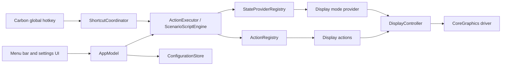

# Architecture

[Русская версия](ARCHITECTURE.ru.md)

Mac Utils separates utility definitions, macOS adapters, and presentation so a new utility does not require a second execution path for the UI or global hotkeys.

## Modules

### MacUtilsCore

`MacUtilsCore` has no AppKit, CoreGraphics, Carbon, or persistence dependency. It owns:

- `UtilityAction`, `ActionMetadata`, and typed `ActionParameter` values;
- `ActionRegistry` and the sequential `ActionExecutor`;
- `StateProvider` and `StateProviderRegistry`;
- scenarios with nested state toggles;
- visual builder domain types;
- the deliberately small DSL parser and serializer;
- scripts, global shortcut values, and persisted configuration value types;
- pure display layout planning.

An action is resolved only through `ActionRegistry`. A state toggle is resolved only through `StateProviderRegistry`. Both a single action and a multi-step script use the same scenario engine.

### MacUtilsSystem

`MacUtilsSystem` implements operating-system boundaries:

- `DisplayController` reads a snapshot, asks the pure `DisplayLayoutPlanner` for operations, and sends one atomic batch to `CoreGraphicsDisplayDriver`;
- display actions and the display-mode provider adapt the display controller to core contracts;
- `CarbonHotKeyRegistrar` uses native global hotkey registration;
- `ShortcutCoordinator` connects registered hotkeys to saved scenarios;
- `ConfigurationStore` validates and atomically replaces local JSON.

No SwiftUI view calls these drivers directly.

### MacUtilsApp

`MacUtilsApp` is the composition and presentation layer:

- the app delegate creates the display manager, action registry, provider registry, coordinator, store, and `AppModel`;
- `AppModel` exposes observable state and routes UI intents through shared actions and scenario services;
- SwiftUI views render the menu bar popover, visual builder, shortcut editor, onboarding, and help;
- `AppText` localizes presentation by stable action/provider identifiers;
- `AppDiagnostics` contains explicit smoke commands and does not add a production execution route.

## Execution invariants

- The complete scenario validates before its first action runs.
- Actions execute sequentially and stop at the first failure.
- Toggle branches read current provider state on every execution.
- The DSL cannot launch processes, call a shell, read arbitrary files, or resolve names outside the registries.
- A shortcut replacement registers the candidate before releasing the prior registration.
- A failed persistence operation restores the observable model and runtime registration; a failed rollback is surfaced explicitly.
- Stored objects that cannot activate remain visible and editable rather than being dropped from the next save.

## Display configuration

CoreGraphics numeric display IDs are runtime-only. Mac Utils stores lowercase UUIDs from `CGDisplayCreateUUIDFromDisplayID` and resolves them against the current online display list before execution.

Display changes are planned from one snapshot and submitted through `CGBeginDisplayConfiguration` and `CGCompleteDisplayConfiguration`. An uncommitted transaction is cancelled on failure. Main-display changes translate the independent display layout so the selected display becomes origin `(0, 0)`. Extending removes mirroring and places the display deterministically to the right of the independent layout.

## Configuration lifecycle

`AppConfiguration` currently has schema version 1. Before v1.0.0 there is no migration layer. The store rejects unsupported or structurally invalid data and returns a safe empty value with a user-visible error. Valid data uses pretty, sorted JSON and an atomic filesystem replacement.

The App Store and direct builds use the same API. App Sandbox automatically redirects Application Support into the app container.

## Project generation and distribution configurations

Swift Package Manager defines modules and package tests. `project.yml` reproducibly generates `MacUtils.xcodeproj` through XcodeGen 2.46.0 or later.

- `MacUtils-Direct` uses the direct-distribution entitlement file.
- `MacUtils-AppStore` enables App Sandbox.
- `MacUtils-UI` isolates the signed XCUITest runner.

Both release configurations enable Hardened Runtime and treat warnings as errors. Local archive scripts disable signing intentionally; protected release automation supplies Apple credentials.

## Verification boundaries

Pure layout, parser, executor, builder, persistence, provider, and hotkey coordination behavior use fakes in unit tests. Integration tests verify shared registry/executor paths. UI-render tests instantiate actual SwiftUI surfaces in English and Russian. Hardware smoke checks use CoreGraphics readback and always restore the observed starting layout.

See [Extending Mac Utils](EXTENDING.md) for the implementation sequence and [Known limitations](KNOWN-LIMITATIONS.md) for confirmed environment constraints.
