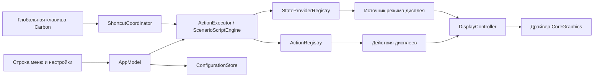

# Архитектура

[English version](ARCHITECTURE.md)

Mac Utils разделяет определения утилит, адаптеры macOS и представление. Поэтому новая утилита не создаёт отдельный путь выполнения для интерфейса или горячих клавиш.

## Модули

### MacUtilsCore

`MacUtilsCore` не зависит от AppKit, CoreGraphics, Carbon или хранилища. Модуль содержит:

- `UtilityAction`, `ActionMetadata` и типизированные `ActionParameter`;
- `ActionRegistry` и последовательный `ActionExecutor`;
- `StateProvider` и `StateProviderRegistry`;
- сценарии с вложенными переключениями по состоянию;
- доменные типы визуального конструктора;
- небольшой безопасный DSL, его parser и serializer;
- значения сценариев, горячих клавиш и сохраняемой конфигурации;
- чистое планирование схемы дисплеев.

Действие разрешается только через `ActionRegistry`, а источник состояния — только через `StateProviderRegistry`. Одно действие и многошаговый сценарий используют один движок.

### MacUtilsSystem

`MacUtilsSystem` реализует границы операционной системы:

- `DisplayController` читает снимок, получает операции от чистого `DisplayLayoutPlanner` и отправляет один атомарный пакет в `CoreGraphicsDisplayDriver`;
- действия и источник режима дисплея адаптируют контроллер к контрактам ядра;
- `CarbonHotKeyRegistrar` регистрирует нативные глобальные сочетания;
- `ShortcutCoordinator` связывает клавиши с сохранёнными сценариями;
- `ConfigurationStore` проверяет и атомарно заменяет локальный JSON.

SwiftUI-представления не вызывают системные драйверы напрямую.

### MacUtilsApp

`MacUtilsApp` — слой композиции и представления:

- app delegate создаёт менеджер дисплеев, реестры, coordinator, store и `AppModel`;
- `AppModel` публикует наблюдаемое состояние и направляет намерения UI через общие действия и сценарии;
- SwiftUI показывает строку меню, конструктор, редактор клавиш, знакомство и справку;
- `AppText` локализует представление по стабильным идентификаторам действий и источников;
- `AppDiagnostics` содержит явные smoke-команды и не создаёт дополнительный production-путь выполнения.

## Инварианты выполнения

- Весь сценарий проверяется до запуска первого действия.
- Действия выполняются последовательно и останавливаются на первой ошибке.
- Переключение читает текущее состояние при каждом запуске.
- DSL не запускает процессы или shell, не читает произвольные файлы и не разрешает имена вне реестров.
- При замене горячей клавиши сначала регистрируется кандидат, затем снимается прежнее назначение.
- При ошибке записи восстанавливаются модель и runtime-регистрация; ошибка самого восстановления показывается явно.
- Неактивируемые сохранённые объекты остаются видимыми и доступными для исправления.

## Конфигурация дисплеев

Числовые идентификаторы CoreGraphics существуют только во время работы. Mac Utils сохраняет UUID из `CGDisplayCreateUUIDFromDisplayID` в нижнем регистре и перед выполнением разрешает его по текущему списку online-дисплеев.

Изменение планируется по одному снимку и отправляется через `CGBeginDisplayConfiguration` и `CGCompleteDisplayConfiguration`. Незавершённая транзакция отменяется при ошибке. При смене основного дисплея независимая схема переносится так, чтобы выбранный дисплей оказался в `(0, 0)`. При расширении зеркало снимается, а дисплей детерминированно размещается справа.

## Жизненный цикл конфигурации

Текущая версия схемы `AppConfiguration` — 1. До v1.0.0 миграционного слоя нет. Store отклоняет неподдерживаемые или структурно некорректные данные и возвращает безопасное пустое значение с видимой ошибкой. Корректная конфигурация записывается как отсортированный JSON с атомарной заменой файла.

Store- и direct-сборки используют один API. App Sandbox автоматически направляет Application Support в контейнер приложения.

## Генерация проекта и варианты распространения

Swift Package Manager определяет модули и package-тесты. `project.yml` воспроизводимо генерирует `MacUtils.xcodeproj` через XcodeGen 2.46.0 или новее.

- `MacUtils-Direct` использует entitlements прямого распространения.
- `MacUtils-AppStore` включает App Sandbox.
- `MacUtils-UI` изолирует подписываемый XCUITest runner.

Обе release-конфигурации включают Hardened Runtime и считают предупреждения ошибками. Локальные архивы намеренно не подписываются; Apple credentials добавляет защищённый релизный процесс.

## Границы проверки

Планирование, parser, executor, builder, store, providers и координация клавиш проверяются unit-тестами с fake-реализациями. Интеграционные тесты проверяют общий путь registry/executor. UI-render тесты создают реальные SwiftUI-экраны на русском и английском. Hardware smoke читает состояние через CoreGraphics и всегда восстанавливает наблюдаемую исходную схему.

Последовательность добавления функции описана в [Расширении Mac Utils](EXTENDING.ru.md), ограничения — в [Известных ограничениях](KNOWN_LIMITATIONS.ru.md).
