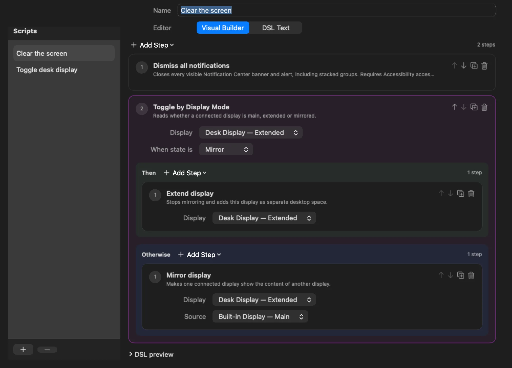
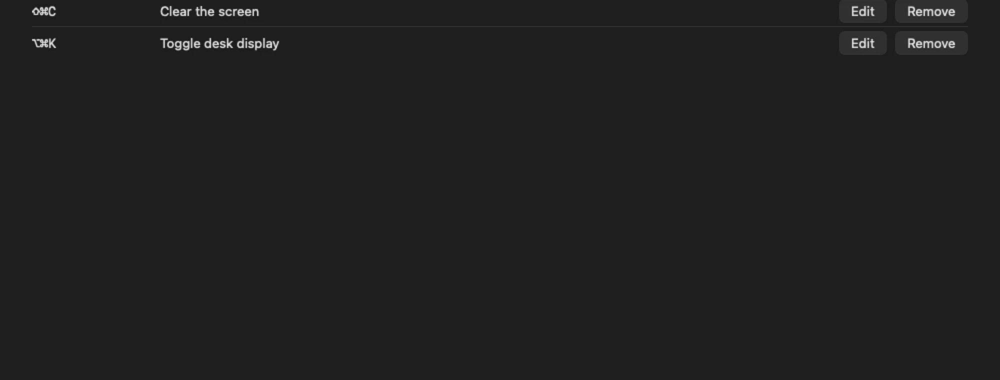

# One key runs your whole script

Mac Utils is a native macOS menu bar app. Compose a script from ready-made actions with the mouse,
branch on the live system state, assign a global keyboard shortcut, and press it from any application.

::::actions{placement="edge"}
::action[Download for macOS]{href="https://github.com/witqq/mac-utils/releases/latest" kind="primary" effect="magnetic"}
::action[View on GitHub]{href="https://github.com/witqq/mac-utils" kind="secondary"}
::action[See what it automates]{href="#actions" kind="quiet"}
::::

::::::section{title="Scripts, not settings screens" id="hero" nav="Overview" recipe="hero" scene="none" interaction="depth" media="natural" media-fit="contain" media-aspect="natural"}
:::lead
A script is an ordered list of actions. You build it visually, save it, and give it one native global
shortcut. The key then runs every step in order while any other app is active.
:::

:::callout{kind="info" title="Requires macOS 26 or later"}
The notarized DMG from GitHub is the full Direct build. The Mac App Store build is sandboxed and ships a
subset of actions; its product link appears here once Apple publishes it.
:::
::::::

::::::section{title="What you can automate today" id="actions" nav="Actions" composition="flow" section-density="editorial" surface="grid" transition="stagger" choreography="cascade"}
:::lead
The catalog of actions grows with every release. Every action is registered by the app itself, so scripts
never run shell commands or downloaded code.
:::

::::cards
:::card{title="Display roles"}
Make a display the main one, extend the desktop onto it, or mirror it from another display. A rotated
display keeps its own resolution when it leaves mirroring.
:::
:::card{title="Toggle by State"}
Read the live mode of a display and run one branch when it matches and another when it does not. One key
extends a mirrored display and mirrors it again later.
:::
:::card{title="Dismiss all notifications"}
Close every Notification Center banner, alert, and stacked group in one press, including alerts that stay
on screen until you close them. Direct build, needs Accessibility access.
:::
:::card{title="Refresh Universal Control"}
Restart the local Continuity services so Universal Control reconnects the trackpad and cursor between your
Macs. Direct build.
:::
:::card{title="Launch at login"}
Start the menu bar app automatically and see the real approval state that macOS reports, with a direct
link to Login Items.
:::
:::card{title="Global shortcuts"}
One native shortcut per script. If macOS rejects a replacement, the previous working shortcut stays
active instead of leaving you with nothing.
:::
::::
::::::

::::::section{title="From idea to key press" id="how-it-works" nav="How it works" recipe="story" media="natural" media-fit="contain" media-aspect="natural"}

::::steps{title="Four steps, no code"}

1. Open **Settings → Scripts**, add a script, and pick actions from the **Add Step** menu.
2. Set the typed parameters each action needs, or add a **Toggle by State** block with **Then** and
   **Otherwise** branches.
3. Open **Shortcuts**, record a key combination with Control, Option, or Command, and select **Assign**.
4. Press the key anywhere. Mac Utils runs the whole script and leaves the menu bar icon where it was.

::::

:::disclosure{title="Prefer text? The same script as data" open="false"}
An optional DSL editor shows every script as plain data: one action per line with named parameters and
`@toggle`, `@match`, `@otherwise`, `@end` blocks. It cannot evaluate expressions, open files, or execute
anything outside the registered actions.
:::
::::::

::::::section{title="Built to keep growing" id="growth" nav="Roadmap" recipe="evidence"}
:::decision{title="Small core, open registries"}
Actions and state providers plug into typed registries. A new action appears in the visual builder, the
DSL, and the shortcut runner at once, so each release can add capabilities without changing how you work.
:::

::::cards
:::card{title="Direct build" href="https://github.com/witqq/mac-utils/releases/latest"}
Signed and notarized DMG from GitHub with every action, including the ones that need Accessibility or
process control.
:::
:::card{title="App Store build"}
Sandboxed edition with the display actions, Toggle by State, shortcuts, and launch at login. Coming to
the Mac App Store after review.
:::
:::card{title="Open source" href="https://github.com/witqq/mac-utils"}
MIT-licensed Swift 6 code with tests, CI, and a guide for adding your own actions.
:::
::::
::::::

::::::section{title="Private by design" id="privacy" nav="Privacy" recipe="evidence"}
:::lead
Mac Utils stores scripts and shortcuts only in its local app container. It has no account, analytics,
advertising, cloud service, or network client, and it collects no personal or usage data.
:::

::::cards
:::card{title="Privacy policy" href="https://github.com/witqq/mac-utils/blob/main/docs/PRIVACY.md"}
What the app stores, where, and what it never sends anywhere.
:::
:::card{title="Support" href="https://github.com/witqq/mac-utils/blob/main/docs/SUPPORT.md"}
Read the user guide or report a reproducible problem on GitHub with your macOS version and setup.
:::
:::card{title="Known limitations" href="https://github.com/witqq/mac-utils/blob/main/docs/KNOWN-LIMITATIONS.md"}
Which actions need which build, what macOS decides on its own, and what is still being verified.
:::
::::
::::::

::::::section{title="Give your Mac one more key" id="download" nav="Download" recipe="hero" align="center"}
English and Russian interface. Requires macOS 26 or later. App Store — coming soon.

:::actions{placement="bottom"}
::action[Download the DMG]{href="https://github.com/witqq/mac-utils/releases/latest" kind="primary" effect="magnetic"}
::action[User guide]{href="https://github.com/witqq/mac-utils/blob/main/docs/USER_GUIDE.md" kind="secondary"}
::action[witqq.dev]{href="https://witqq.dev/" kind="quiet"}
::action[Made with Moira]{href="https://moira-mcp.com/" kind="quiet"}
:::

© 2026 witqq · MIT License
::::::
