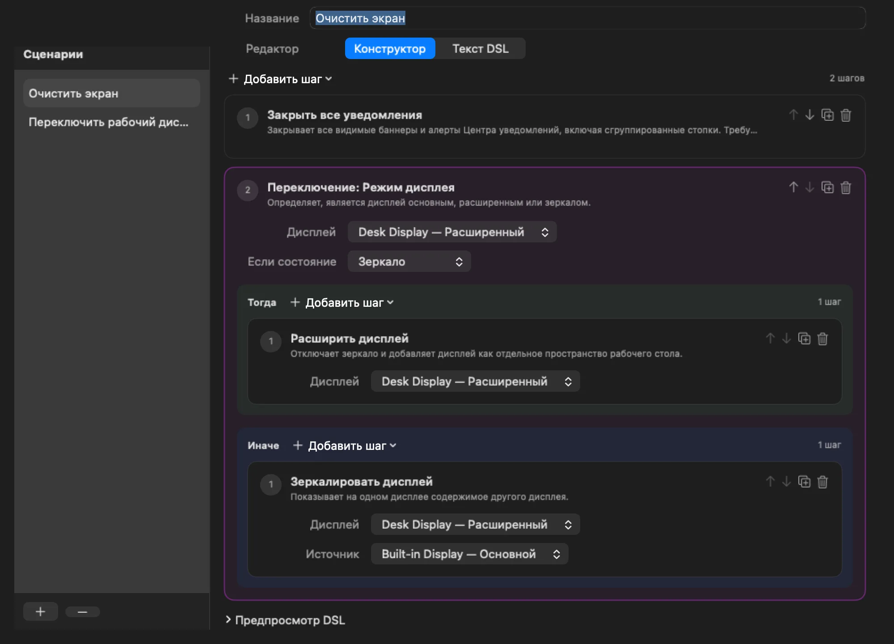
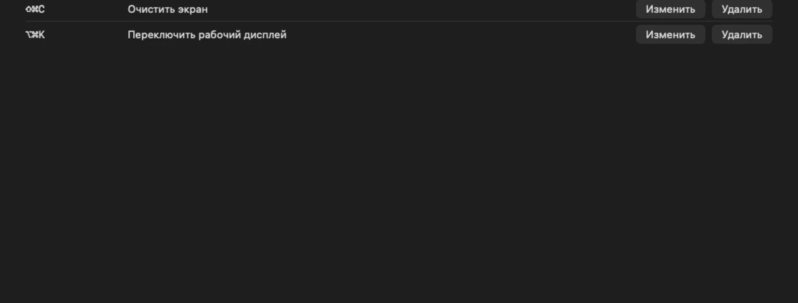

# Одна клавиша запускает весь сценарий

Mac Utils — нативное приложение в строке меню macOS. Соберите сценарий из готовых действий мышкой,
добавьте ветвление по текущему состоянию системы, назначьте глобальную горячую клавишу и нажимайте её
из любого приложения.

::::actions{placement="edge"}
::action[Скачать для macOS]{href="https://github.com/witqq/mac-utils/releases/latest" kind="primary" effect="magnetic"}
::action[Открыть GitHub]{href="https://github.com/witqq/mac-utils" kind="secondary"}
::action[Что можно автоматизировать]{href="#actions" kind="quiet"}
::::

::::::section{title="Сценарии вместо экранов настроек" id="hero" nav="Обзор" recipe="hero" scene="none" interaction="depth" media="natural" media-fit="contain" media-aspect="natural"}
:::lead
Сценарий — упорядоченный список действий. Вы собираете его мышкой, сохраняете и назначаете одну нативную
глобальную клавишу. Клавиша выполняет все шаги по порядку, пока активно любое другое приложение.
:::

:::callout{kind="info" title="Требуется macOS 26 или новее"}
Нотариально заверенный DMG с GitHub — полная Direct-сборка. Сборка для Mac App Store работает в песочнице
и содержит часть действий; ссылка на неё появится здесь после публикации Apple.
:::
::::::

::::::section{title="Что можно автоматизировать уже сейчас" id="actions" nav="Действия" composition="flow" section-density="editorial" surface="grid" transition="stagger" choreography="cascade"}
:::lead
Набор действий растёт с каждым выпуском. Каждое действие зарегистрировано самим приложением, поэтому
сценарии никогда не выполняют shell-команды или загруженный код.
:::

::::cards
:::card{title="Роли дисплеев"}
Сделайте дисплей основным, расширьте на него рабочий стол или включите зеркало с другого дисплея.
Повёрнутый дисплей сохраняет своё разрешение при выходе из зеркала.
:::
:::card{title="Переключение по состоянию"}
Прочитайте текущий режим дисплея и выполните одну ветку при совпадении и другую — при несовпадении. Одна
клавиша расширяет зеркальный дисплей и позже снова включает зеркало.
:::
:::card{title="Закрыть все уведомления"}
Закройте все баннеры, алерты и стопки Центра уведомлений одним нажатием, включая алерты, которые висят
на экране до ручного закрытия. Direct-сборка, нужно право «Универсальный доступ».
:::
:::card{title="Обновить Universal Control"}
Перезапустите локальные службы Continuity, чтобы Universal Control снова соединил трекпад и курсор между
вашими Mac. Direct-сборка.
:::
:::card{title="Запуск при входе"}
Запускайте приложение строки меню автоматически и видьте фактическое состояние разрешения macOS с прямым
переходом к объектам входа.
:::
:::card{title="Глобальные горячие клавиши"}
Одна нативная клавиша на сценарий. Если macOS отклонит замену, прежнее рабочее сочетание останется
активным, а не оставит вас без клавиши.
:::
::::
::::::

::::::section{title="От идеи до нажатия клавиши" id="how-it-works" nav="Как это работает" recipe="story" media="natural" media-fit="contain" media-aspect="natural"}

::::steps{title="Четыре шага без кода"}

1. Откройте **Настройки → Сценарии**, добавьте сценарий и выберите действия в меню **Добавить шаг**.
2. Задайте типизированные параметры каждого действия или добавьте блок **Переключение по состоянию** с
   ветками **Тогда** и **Иначе**.
3. Откройте **Горячие клавиши**, запишите сочетание с Control, Option или Command и нажмите **Назначить**.
4. Нажимайте клавишу где угодно. Mac Utils выполнит весь сценарий, а значок в строке меню останется на месте.

::::

:::disclosure{title="Предпочитаете текст? Тот же сценарий как данные" open="false"}
Дополнительный редактор DSL показывает каждый сценарий как обычные данные: одно действие в строке с
именованными параметрами и блоки `@toggle`, `@match`, `@otherwise`, `@end`. Он не вычисляет выражения,
не открывает файлы и не выполняет ничего, кроме зарегистрированных действий.
:::
::::::

::::::section{title="Создано, чтобы расти" id="growth" nav="Развитие" recipe="evidence"}
:::decision{title="Маленькое ядро, открытые реестры"}
Действия и источники состояния подключаются к типизированным реестрам. Новое действие сразу появляется в
визуальном конструкторе, DSL и запуске по клавише, поэтому каждый выпуск добавляет возможности, не меняя
привычный способ работы.
:::

::::cards
:::card{title="Direct-сборка" href="https://github.com/witqq/mac-utils/releases/latest"}
Подписанный и нотариально заверенный DMG с GitHub со всеми действиями, включая те, которым нужны
«Универсальный доступ» или управление процессами.
:::
:::card{title="Сборка для App Store"}
Версия в песочнице с действиями для дисплеев, переключением по состоянию, горячими клавишами и
автозапуском. Появится в Mac App Store после проверки.
:::
:::card{title="Открытый код" href="https://github.com/witqq/mac-utils"}
Код на Swift 6 под лицензией MIT с тестами, CI и руководством по добавлению собственных действий.
:::
::::
::::::

::::::section{title="Конфиденциальность по умолчанию" id="privacy" nav="Конфиденциальность" recipe="evidence"}
:::lead
Mac Utils хранит сценарии и горячие клавиши только в локальном контейнере приложения. У него нет аккаунта,
аналитики, рекламы, облачного сервиса и сетевого клиента, и оно не собирает персональные или технические
данные.
:::

::::cards
:::card{title="Политика конфиденциальности" href="https://github.com/witqq/mac-utils/blob/main/docs/PRIVACY.ru.md"}
Что приложение хранит, где именно и чего никогда никуда не отправляет.
:::
:::card{title="Поддержка" href="https://github.com/witqq/mac-utils/blob/main/docs/SUPPORT.ru.md"}
Откройте руководство пользователя или сообщите о воспроизводимой проблеме на GitHub, указав версию macOS
и конфигурацию.
:::
:::card{title="Известные ограничения" href="https://github.com/witqq/mac-utils/blob/main/docs/KNOWN_LIMITATIONS.ru.md"}
Каким действиям нужна какая сборка, что macOS решает сама и что ещё проверяется.
:::
::::
::::::

::::::section{title="Дайте своему Mac ещё одну клавишу" id="download" nav="Скачать" recipe="hero" align="center"}
Интерфейс на русском и английском. Требуется macOS 26 или новее. App Store — скоро.

:::actions{placement="bottom"}
::action[Скачать DMG]{href="https://github.com/witqq/mac-utils/releases/latest" kind="primary" effect="magnetic"}
::action[Руководство пользователя]{href="https://github.com/witqq/mac-utils/blob/main/docs/USER_GUIDE.ru.md" kind="secondary"}
::action[witqq.dev]{href="https://witqq.dev/" kind="quiet"}
::action[Made with Moira]{href="https://moira-mcp.com/" kind="quiet"}
:::

© 2026 witqq · Лицензия MIT
::::::
